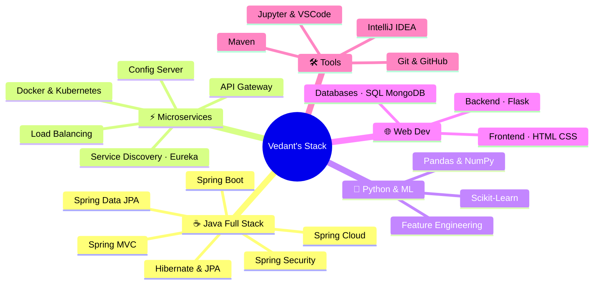

<div align="center">


<p>
  
  
  
</p>


</div>

---

## 🧭 About Me

```java
public class Vedant extends Developer {

    String university  = "PCCOE — B.Tech Computer Science (Final Year)";
    String[] focus     = {"Java Full Stack", "Spring Ecosystem", "Microservices", "ML/AI"};
    String philosophy  = "Iroiro Arigato Gozaimashita 🙏";
    boolean openToWork = true;

    public String[] currentlyLearning() {
        return new String[] {
            "Spring Cloud & Microservices Architecture",
            "Docker + Kubernetes for container orchestration",
            "LLM Integration & Advanced ML Pipelines"
        };
    }
}
```

---

## 🛠️ Tech Stack

### ☕ Java Ecosystem

<div align="center">


</div>

### ⚡ Microservices & Cloud-Native

<div align="center">


</div>

### 🐍 Python & ML/AI

<div align="center">


</div>

### 🌐 Frontend & Web

<div align="center">


</div>

### 🗄️ Databases & Tools

<div align="center">


</div>

---

## 📊 GitHub Analytics

<div align="center">
  
  
</div>

<div align="center">
  
</div>

<div align="center">
  
</div>

---

## 🎯 Current Focus



---

## 🏗️ Microservices Architecture I Work With

```
┌─────────────────────────────────────────────────────────────────┐
│                        CLIENT LAYER                             │
│              Browser / Mobile / External APIs                   │
└─────────────────────┬───────────────────────────────────────────┘
                       │
┌─────────────────────▼───────────────────────────────────────────┐
│                     API GATEWAY                                 │
│            (Spring Cloud Gateway / Routing)                     │
└───────┬─────────────┬──────────────┬────────────────────────────┘
        │             │              │
┌───────▼──┐   ┌──────▼──┐   ┌──────▼──┐
│ Service A│   │Service B│   │Service C│    ← Spring Boot Apps
│(Auth/JWT)│   │(Business│   │(Data/ML)│
└───────┬──┘   └──────┬──┘   └──────┬──┘
        │             │              │
┌───────▼─────────────▼──────────────▼────────────────────────────┐
│                  SERVICE REGISTRY (Eureka)                      │
└─────────────────────────────────────────────────────────────────┘
        │             │              │
┌───────▼──┐   ┌──────▼──┐   ┌──────▼──┐
│  MySQL   │   │ MongoDB │   │  Redis  │    ← Data Layer
└──────────┘   └─────────┘   └─────────┘
```

---

## 🏆 GitHub Trophies

<div align="center">
  
</div>

---

## 📬 Connect with Me

<div align="center">

[](mailto:vedant.kale22@pccoepune.org)
[](https://www.linkedin.com/in/vedantkale106/)
[](https://github.com/VedantKale106)

</div>

---

<div align="center">
  
</div>


<div align="center">
  <sub>⭐ If you find my work interesting, consider starring a repo! Thank you for visiting 😊</sub>
</div>
