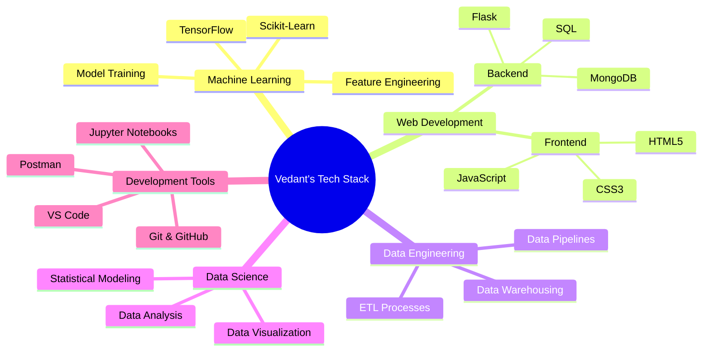

<h1 align="center">
  
</h1>

<p align="center">
  
  
  
</p>

<div align="center">
  
</div>


## 🚀 About Me


> *"Iroiro Arigato Gozaimashita 🙏"*

```python
class Vedant:
    def __init__(self):
        self.name = "Vedant Kale"
        self.role = "BTech Student | Aspiring ML Engineer"
        self.education = "Computer Science @ PCCOE"
        self.location = "Pune, India"
        self.interests = [
            "Machine Learning",
            "Web Development", 
            "Data Science",
            "Philosophy",
            "Self-Development"
        ]
    
    def say_hi(self):
        print("Thanks for dropping by! Let's connect and build something amazing together!")

me = Vedant()
me.say_hi()
```

<br>

- 👨‍💻 Final-year **BTech student** in **Computer Science** 
- 🌟 Passionate about **Self-Development**, **Coding**, **Philosophy**, and **Technology**
- 🎯 Currently focusing on **Machine Learning**, **AI**, and **Web Development**
- 🌱 Always learning and exploring new technologies
- 💡 Open to collaborating on projects involving **ML**, **AI**, **Web Apps**, and **Data Engineering**
- 📫 Reach me at: **vedant.kale22@pccoepune.org**


## 🛠️ Tech Stack

<div align="center">

### 💻 Programming Languages

<p>
  
  
  
  
  
  
  
</p>

### 🚀 Frameworks & Libraries

<p>
  
  
  
  
  
  
  
</p>

### 🛠️ Tools & Platforms

<p>
  
  
  
  
  
  
  
</p>

</div>


## 📊 GitHub Statistics

<div align="center">
  
  
</div>

<div align="center">
  
  
</div>

<div align="center">
  
</div>


## 🎯 Current Focus




## 💼 Skills Overview

<div align="center">

| Category | Skills |
|----------|--------|
| **🤖 Machine Learning** | Supervised Learning, Unsupervised Learning, Feature Engineering, Model Optimization |
| **🌐 Web Development** | Flask, RESTful APIs, HTML/CSS, Database Integration |
| **📊 Data Science** | Data Analysis, Data Visualization, Statistical Analysis, Pandas, NumPy |
| **🗄️ Databases** | MySQL, MongoDB, SQL Queries, Database Design |
| **🔧 Dev Tools** | Git, GitHub, Jupyter, VS Code, Linux |

</div>


## 📈 Coding Activity

<div align="center">
  
<!--START_SECTION:waka-->
<!--END_SECTION:waka-->


</div>


## 🌟 What I'm Learning

<div align="center">

```python
current_learning = {
    "Advanced ML": ["Deep Learning", "Neural Networks", "NLP"],
    "Web Development": ["React", "Node.js", "FastAPI"],
    "Data Engineering": ["Apache Spark", "Airflow", "Data Pipelines"],
    "Cloud": ["AWS", "Docker", "Kubernetes"],
    "Tools": ["MLflow", "DVC", "CI/CD"]
}

for category, skills in current_learning.items():
    print(f"📚 {category}: {', '.join(skills)}")
```

</div>


## 📬 Let's Connect!

<div align="center">

<a href="mailto:vedant.kale22@pccoepune.org">
  
</a>
<a href="https://www.linkedin.com/in/vedantkale106/">
  
</a>
<a href="https://github.com/VedantKale106">
  
</a>

</div>


## 💡 Random Dev Quote

<div align="center">
  


</div>


## 🐍 Contribution Snake

<div align="center">
  


</div>


<div align="center">
  
### 💭 Thought of the Day

*"The only way to do great work is to love what you do."* - Steve Jobs

</div>


<div align="center">
  
</div>

<h3 align="center">
  Thanks for visiting! 😊
  <br><br>
  
</h3>

<div align="center">
  
### Show some ❤️ by starring some of my repositories!

</div>
