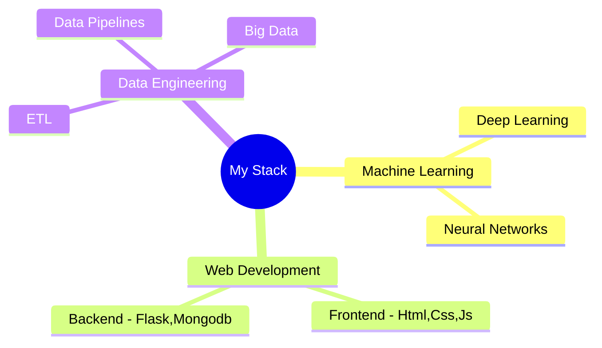

<h1 align="center">
  
</h1>

  
  

  

## 🚀 About Me
> *"The only way to do great work is to love what you do."* - Steve Jobs

👨‍💻 I'm a **3rd-year BTech student** in **Computer Science** at **PCCOE**  
🌟 Passionate about **Self-Development**, **Coding**, **Philosophy**, and **Technology**  
🎯 Currently focusing on **Machine Learning**, **AI**, and **Web Development**  
🌱 Always learning and exploring new technologies  
💡 Open to collaborating on projects involving **ML**, **AI**, **Web Apps**, and **Data Engineering**

## 🛠️ Tech Stack

### 💻 Languages

### 🔧 Frameworks & Tools

## 📊 GitHub Statistics

  
  

## 🎯 Current Focus

## 🌟 Achievements & Activities
- 🏆 Active participant in coding competitions
- 📚 Regular contributor to open-source projects
- 💻 LeetCode & HackerRank enthusiast
- 📖 Philosophy book club member

## 📬 Let's Connect!

  

---

  

<h3 align="center">Thank you for visiting! 😊</h3>
